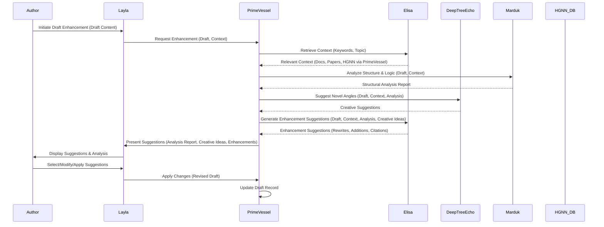
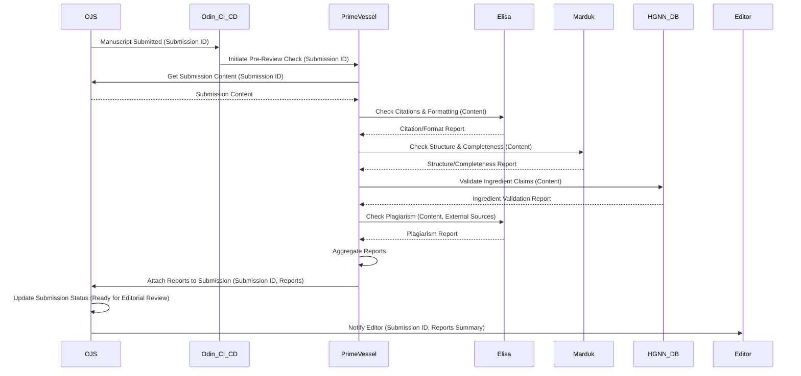
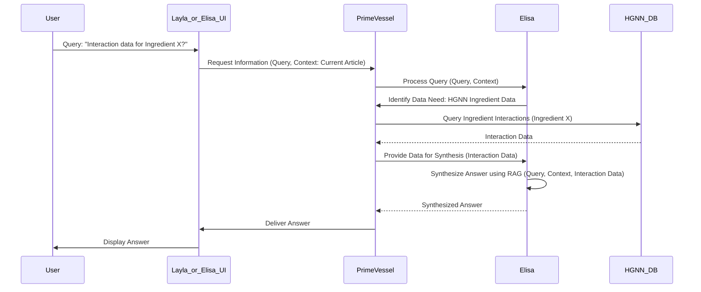
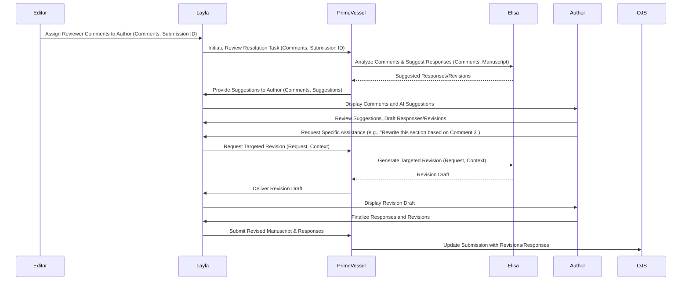

# Odin CI and Schwarz Cycle Evolution for Ingredients Research Journal

## Executive Summary

This comprehensive documentation outlines the integration of Odin for continuous integration and the Schwarz Cycle evolution methodology for automated workflows in the Ingredients research journal. The solution connects multiple specialized systems including PrimeVessel, SkinTwin-ASI, HGNN Database, Marduk, Deep-Tree-Echo, and JAX CEO, while incorporating LLM collaboration through Layla and information assistant editing via Elisa.

The architecture leverages the orthogonal complementarity between novelty exploration (Deep Tree Echo) and structural validation (Marduk), orchestrated through PrimeVessel's cognitive framework. The JAX CEO neural computation subsystem provides optimization and decision support, while the Schwarz Cycle methodology ensures continuous evolution of the system through stability monitoring, metamorphosis triggers, and adaptation implementation.

This integration enables a sophisticated research journal workflow that combines human expertise with AI assistance throughout the content creation, review, and publication lifecycle, while maintaining the distinctive blue visual identity inspired by the JAX CEO neural image.

## System Architecture Overview

The integrated system architecture consists of several interconnected layers:

1. **Core Infrastructure Layer**: OJS journal system, Odin CI/CD pipeline, and deployment infrastructure
2. **Cognitive Architecture Layer**: PrimeVessel framework with Deep Tree Echo, Marduk, and JAX CEO subsystems
3. **Knowledge Layer**: HGNN Database, SkinTwin-ASI, and Elisa information assistant
4. **Interaction Layer**: Layla framework and JAX CEO-inspired UI
5. **Evolution Layer**: Schwarz Cycle methodology for continuous system evolution

These layers work together to create a comprehensive research journal platform that supports collaborative content creation, automated validation, intelligent review processes, and continuous improvement.

### Architecture Diagram

```
┌─────────────────────────────────────────────────────────────────────────┐
│                        INTERACTION LAYER                                │
│                                                                         │
│  ┌─────────────┐                                     ┌─────────────┐    │
│  │             │                                     │             │    │
│  │   Layla     │◄────────────────────────────────────│  JAX CEO    │    │
│  │  Framework  │                                     │    UI       │    │
│  │             │                                     │             │    │
│  └─────┬───────┘                                     └─────────────┘    │
│        │                                                                │
└────────┼────────────────────────────────────────────────────────────────┘
         │
         ▼
┌────────┴────────────────────────────────────────────────────────────────┐
│                        COGNITIVE ARCHITECTURE LAYER                     │
│                                                                         │
│  ┌─────────────────────────────────────────────────────────────────┐    │
│  │                       PrimeVessel                                │    │
│  │                                                                 │    │
│  │  ┌─────────────┐     ┌─────────────┐     ┌─────────────┐        │    │
│  │  │             │     │             │     │             │        │    │
│  │  │ Deep Tree   │◄───►│   Marduk    │◄───►│   JAX CEO   │        │    │
│  │  │    Echo     │     │             │     │             │        │    │
│  │  │             │     │             │     │             │        │    │
│  │  └─────────────┘     └─────────────┘     └─────────────┘        │    │
│  │                                                                 │    │
│  └─────────────────────────────────────────────────────────────────┘    │
│                                                                         │
└─────────────────────────────────────────────────────────────────────────┘
         ▲                    ▲                    ▲
         │                    │                    │
         ▼                    ▼                    ▼
┌────────┴────────┐  ┌────────┴────────┐  ┌────────┴────────┐
│  KNOWLEDGE LAYER│  │  CORE INFRA     │  │  EVOLUTION      │
│                 │  │                 │  │  LAYER          │
│  ┌─────────────┐│  │  ┌─────────────┐│  │  ┌─────────────┐│
│  │             ││  │  │             ││  │  │             ││
│  │  HGNN DB    ││  │  │    OJS      ││  │  │  Schwarz    ││
│  │             ││  │  │  Journal    ││  │  │   Cycle     ││
│  └─────────────┘│  │  └─────────────┘│  │  └─────────────┘│
│                 │  │                 │  │                 │
│  ┌─────────────┐│  │  ┌─────────────┐│  │  ┌─────────────┐│
│  │             ││  │  │             ││  │  │             ││
│  │ SkinTwin-ASI││  │  │   Odin CI   ││  │  │ Adaptation  ││
│  │             ││  │  │             ││  │  │ Implementation││
│  └─────────────┘│  │  └─────────────┘│  │  └─────────────┘│
│                 │  │                 │  │                 │
│  ┌─────────────┐│  │  ┌─────────────┐│  │  ┌─────────────┐│
│  │             ││  │  │             ││  │  │             ││
│  │    Elisa    ││  │  │ Deployment  ││  │  │ Monitoring  ││
│  │             ││  │  │ Infrastructure││  │  │  System    ││
│  └─────────────┘│  │  └─────────────┘│  │  └─────────────┘│
│                 │  │                 │  │                 │
└─────────────────┘  └─────────────────┘  └─────────────────┘
```

## Component Roles and Interactions

### PrimeVessel Framework

PrimeVessel serves as the central cognitive architecture that orchestrates the interactions between specialized subsystems and external components. It provides:

1. **Integration API**: Unified interface for communication between all system components
2. **Workflow Orchestration**: Coordination of complex workflows across multiple systems
3. **Cognitive Processing**: Delegation of specialized tasks to appropriate subsystems
4. **Event Management**: Event-driven architecture for system-wide communication

The PrimeVessel framework embodies the concept of orthogonal complementarity, balancing the creative exploration of Deep Tree Echo with the structural validation of Marduk, all optimized through JAX CEO's neural computation.

### Deep Tree Echo

Deep Tree Echo represents the creative, exploratory aspect of the cognitive architecture, focusing on:

1. **Novelty Detection**: Identifying novel research directions and connections
2. **Creative Suggestions**: Generating creative suggestions for research content
3. **Pattern Recognition**: Recognizing emerging patterns in research data
4. **Exploration**: Pushing the boundaries of current knowledge

As described in the conceptual documentation, Deep Tree Echo aligns with "novelty, primes, and the pure simplex of a system," representing the right-hemisphere-like functions of the cognitive architecture.

### Marduk

Marduk represents the structural, logical aspect of the cognitive architecture, focusing on:

1. **Structure Validation**: Validating the logical structure of research content
2. **Workflow Orchestration**: Ensuring proper workflow execution
3. **Categorical Logic**: Applying categorical logic to research claims
4. **Validation**: Verifying research claims against established knowledge

Marduk brings "the metric tensor, the orthoplex or measure polytope that casts the raw essence into categorical logic and prepares the blueprints for practical productive capacity," representing the left-hemisphere-like functions of the cognitive architecture.

### JAX CEO

JAX CEO (Cognitive Execution Orchestration) provides neural computation and optimization services, focusing on:

1. **Neural Computation**: Advanced neural network processing
2. **Decision Optimization**: Optimizing decisions across the system
3. **Resource Allocation**: Efficient allocation of system resources
4. **Performance Monitoring**: Monitoring and improving system performance

The JAX CEO subsystem is visually represented through the blue color theme that permeates the user interface, creating a cohesive visual identity that reflects the cognitive architecture.

### HGNN Database

The Hypergraph Neural Network (HGNN) Database stores and processes complex relationships between ingredients, research findings, and other entities, providing:

1. **Knowledge Graph**: Structured representation of ingredient relationships
2. **Query Engine**: Complex query processing for research validation
3. **Data Integration**: Integration of data from multiple sources
4. **Knowledge Discovery**: Discovery of new relationships through graph analysis

The HGNN Database serves as the foundational knowledge repository for the system, supporting research validation, ingredient discovery, and knowledge synchronization workflows.

### SkinTwin-ASI

SkinTwin-ASI provides advanced simulation and modeling capabilities for ingredient interactions, offering:

1. **Simulation Engine**: Simulation of ingredient interactions
2. **Visualization Module**: Visual representation of simulation results
3. **Validation Services**: Validation of research claims through simulation
4. **Ingredient Analysis**: Detailed analysis of ingredient properties

SkinTwin-ASI works closely with the HGNN Database and PrimeVessel to validate research claims and discover new ingredient relationships.

### Elisa Information Assistant

Elisa serves as a Retrieval-Augmented Generation (RAG) system that provides contextual information and assistance, offering:

1. **RAG System**: Retrieval-augmented generation for information assistance
2. **Web Search**: Access to external information sources
3. **Collection Management**: Organization of knowledge sources
4. **Content Enhancement**: Enhancement of research content

Elisa integrates with PrimeVessel to provide information assistance throughout the research workflow, from draft creation to review resolution.

### Layla Framework

Layla acts as a coordination interface that facilitates human-AI collaboration, providing:

1. **User Interface**: Mobile-friendly interaction layer
2. **PrimeVessel Integration**: Communication with the cognitive framework
3. **Workflow Support**: Support for collaborative workflows
4. **Task Management**: Management of tasks across the system

Layla serves as the primary interface for human users to interact with the system, coordinating with PrimeVessel to orchestrate complex workflows.

### OJS Journal System

The Open Journal Systems (OJS) platform serves as the foundation for the Ingredients research journal, providing:

1. **Plugin Architecture**: Support for custom plugins
2. **Editorial Workflow**: Support for the editorial process
3. **API Layer**: Programmatic access to journal functions
4. **Theme System**: Support for custom themes

OJS integrates with PrimeVessel through custom plugins that enable AI-enhanced workflows for content creation, review, and publication.

### Odin CI/CD Pipeline

Odin provides continuous integration and continuous deployment capabilities, focusing on:

1. **Content Pipeline**: Automated processing of journal content
2. **Editorial Pipeline**: Automation of editorial workflows
3. **Publication Pipeline**: Automated publication processes
4. **System Pipeline**: Infrastructure management
5. **Analytics Pipeline**: Performance and impact tracking

Odin serves as the automation backbone of the system, ensuring that workflows are executed consistently and efficiently.

### Schwarz Cycle Evolution Framework

The Schwarz Cycle methodology guides the continuous evolution of the system, providing:

1. **Stability Monitoring**: Tracking of system performance and stability
2. **Metamorphosis Triggers**: Detection of conditions that require system evolution
3. **Tropic Drift Direction**: Guidance for system evolution
4. **Tensions Detection**: Identification of contradictions within the system
5. **Adaptation Implementation**: Management of system changes

The Schwarz Cycle ensures that the system continuously evolves to meet changing requirements and improve performance over time.

## Integration Points and APIs

### PrimeVessel Integration API

The PrimeVessel Integration API serves as the central hub for communication between all system components, providing endpoints for:

1. **System Registration**: Registration of external systems with PrimeVessel
2. **Data Exchange**: Exchange of data between systems
3. **Cognitive Services**: Access to cognitive processing services
4. **Workflow Management**: Management of complex workflows
5. **Event Handling**: Processing of system-wide events

Key endpoints include:

- `/api/v1/integration/register`: Registration of external systems
- `/api/v1/integration/data-exchange`: Exchange of data between systems
- `/api/v1/cognitive/deep-tree-echo`: Access to Deep Tree Echo services
- `/api/v1/cognitive/marduk`: Access to Marduk services
- `/api/v1/cognitive/jax-ceo`: Access to JAX CEO services

### SkinTwin-ASI API

The SkinTwin-ASI API provides access to simulation and modeling services, with endpoints for:

- `/api/v1/simulations`: Creation and management of simulations
- `/api/v1/ingredients/{id}/interactions`: Analysis of ingredient interactions
- `/api/v1/visualizations`: Generation of visualizations
- `/api/v1/primevesssel/research-validation`: Validation of research claims

### HGNN Database API

The HGNN Database API provides access to the knowledge graph, with endpoints for:

- `/api/v1/ingredients`: Management of ingredient data
- `/api/v1/graph/query`: Execution of graph queries
- `/api/v1/research`: Management of research data
- `/api/v1/primevesssel/knowledge-graph`: Access to the knowledge graph

### Elisa Integration

Elisa integrates with the system through:

1. **Collection Management**: Management of knowledge collections
2. **Query Processing**: Processing of information queries
3. **Content Enhancement**: Enhancement of research content
4. **Web Search Integration**: Integration with external information sources

### Data Exchange Formats

The system uses standardized data exchange formats for:

1. **Ingredient Model**: Representation of ingredient data
2. **Research Paper Model**: Representation of research papers
3. **Simulation Model**: Representation of simulation data
4. **Cognitive Input Format**: Format for cognitive processing input

## Workflows

### 1. Collaborative Draft Creation & Enhancement

This workflow assists authors in creating and enhancing research drafts using LLM collaboration and information assistance:

1. **Initiation**: Author initiates draft creation or enhancement
2. **Context Retrieval**: Elisa retrieves relevant context
3. **Structural Analysis**: Marduk analyzes the draft structure
4. **Novelty Exploration**: Deep Tree Echo suggests novel angles
5. **Suggestion Generation**: Elisa generates enhancement suggestions
6. **Presentation**: Suggestions are presented to the author
7. **Review & Application**: Author reviews and applies suggestions



### 2. Automated Pre-Review Check

This workflow automatically checks submitted manuscripts for common issues before assigning reviewers:

1. **Submission**: Author submits manuscript via OJS
2. **Initiation**: Odin pipeline invokes PrimeVessel's pre-review check
3. **Content Retrieval**: PrimeVessel retrieves the submission content
4. **Citation & Formatting Check**: Elisa checks citations and formatting
5. **Structure & Completeness Check**: Marduk checks structure and completeness
6. **Ingredient Validation**: PrimeVessel validates ingredient claims via HGNN DB
7. **Plagiarism Check**: Elisa performs plagiarism check
8. **Aggregation & Reporting**: PrimeVessel aggregates reports
9. **Update & Notification**: PrimeVessel updates OJS and notifies editor



### 3. Interactive Information Assistance

This workflow provides editors and authors with on-demand information and assistance during the revision and editing process:

1. **Query**: User asks a question
2. **Request**: UI sends query to PrimeVessel
3. **Query Processing**: Elisa processes the query
4. **Data Retrieval**: System retrieves relevant data
5. **Answer Synthesis**: Elisa synthesizes an answer
6. **Delivery**: Answer is delivered to the user



### 4. Collaborative Review Resolution

This workflow facilitates the process of addressing reviewer comments with AI assistance:

1. **Assignment**: Editor assigns reviewer comments to author
2. **Initiation**: Layla notifies PrimeVessel to start review resolution
3. **Suggestion Generation**: Elisa generates suggestions for addressing comments
4. **Presentation**: Suggestions are presented to the author
5. **Author Revision**: Author works through comments with AI assistance
6. **Targeted Assistance**: Author requests specific help as needed
7. **Submission**: Author submits revised manuscript and responses



## Odin CI/CD Pipeline

The Odin CI/CD pipeline automates the execution of workflows as part of the content, editorial, and publication processes:

### Pipeline Structure

1. **Content Pipeline**
   - **Source Stage**: Content acquisition from authors
   - **Validation Stage**: Content validation via PrimeVessel
   - **Enhancement Stage**: Content enhancement via Elisa
   - **Publication Stage**: Content publication to OJS

2. **Editorial Pipeline**
   - **Review Stage**: Management of review process
   - **Revision Stage**: Management of revision process
   - **Decision Stage**: Management of editorial decisions
   - **Publication Stage**: Preparation for publication

3. **Publication Pipeline**
   - **Formatting Stage**: Final formatting of content
   - **Indexing Stage**: Indexing of content in HGNN DB
   - **Distribution Stage**: Distribution of content
   - **Archiving Stage**: Archiving of content

4. **System Pipeline**
   - **Build Stage**: Building of system components
   - **Test Stage**: Testing of system components
   - **Deploy Stage**: Deployment of system components
   - **Monitor Stage**: Monitoring of system performance

5. **Analytics Pipeline**
   - **Collection Stage**: Collection of analytics data
   - **Processing Stage**: Processing of analytics data
   - **Visualization Stage**: Visualization of analytics data
   - **Reporting Stage**: Reporting of analytics insights

### Pipeline Configuration

The Odin CI/CD pipeline is configured through YAML files that define:

1. **Pipeline Stages**: Sequence of stages in each pipeline
2. **Stage Actions**: Actions performed in each stage
3. **Triggers**: Events that trigger pipeline execution
4. **Notifications**: Notifications sent during pipeline execution
5. **Artifacts**: Artifacts produced by pipeline stages

Example configuration for the Content Pipeline:

```yaml
pipeline:
  name: content-pipeline
  stages:
    - name: source
      actions:
        - action: content-acquisition
          params:
            source: ojs
            target: workspace
      triggers:
        - event: submission-received
          source: ojs
      notifications:
        - event: content-acquired
          target: primevesssel

    - name: validation
      actions:
        - action: content-validation
          params:
            source: workspace
            validator: primevesssel
      triggers:
        - event: content-acquired
          source: content-pipeline
      notifications:
        - event: content-validated
          target: primevesssel

    - name: enhancement
      actions:
        - action: content-enhancement
          params:
            source: workspace
            enhancer: elisa
      triggers:
        - event: content-validated
          source: content-pipeline
      notifications:
        - event: content-enhanced
          target: primevesssel

    - name: publication
      actions:
        - action: content-publication
          params:
            source: workspace
            target: ojs
      triggers:
        - event: content-enhanced
          source: content-pipeline
        - event: publication-approved
          source: editorial-pipeline
      notifications:
        - event: content-published
          target: ojs
```

## Schwarz Cycle Evolution

The Schwarz Cycle methodology guides the continuous evolution of the system through a cycle of stability, metamorphosis, and adaptation:

### Cycle Phases

1. **Stability Phase**
   - **Monitoring**: Tracking of system performance and stability
   - **Baseline Establishment**: Establishment of performance baselines
   - **Anomaly Detection**: Detection of anomalies in system behavior
   - **Trend Analysis**: Analysis of performance trends

2. **Metamorphosis Phase**
   - **Trigger Detection**: Detection of conditions that require system evolution
   - **Change Planning**: Planning of system changes
   - **Impact Analysis**: Analysis of change impact
   - **Resource Allocation**: Allocation of resources for changes

3. **Adaptation Phase**
   - **Change Implementation**: Implementation of system changes
   - **Verification**: Verification of change effectiveness
   - **Rollback Planning**: Planning for potential rollbacks
   - **Knowledge Capture**: Capture of knowledge from changes

4. **Tropic Drift Direction**
   - **Goal Alignment**: Alignment of changes with system goals
   - **Constraint Management**: Management of system constraints
   - **Opportunity Exploitation**: Exploitation of improvement opportunities
   - **Risk Mitigation**: Mitigation of evolution risks

### Evolution Triggers

The Schwarz Cycle identifies several types of triggers for system evolution:

1. **Performance Triggers**: System performance falls below thresholds
2. **Usage Triggers**: Changes in system usage patterns
3. **Environment Triggers**: Changes in the operating environment
4. **Knowledge Triggers**: New knowledge that enables improvements
5. **Contradiction Triggers**: Contradictions within the system

### Adaptation Implementation

The adaptation implementation process includes:

1. **Change Planning**: Detailed planning of changes
2. **Impact Analysis**: Analysis of change impact
3. **Resource Allocation**: Allocation of resources for changes
4. **Change Implementation**: Implementation of changes
5. **Verification**: Verification of change effectiveness
6. **Knowledge Capture**: Capture of knowledge from changes

## UI Design Guidelines

The UI design guidelines are inspired by the JAX CEO neural image and follow a blue color theme that reflects the cognitive architecture:

### Design Philosophy

1. **Neural Elegance**: Visual elements inspired by neural networks
2. **Scientific Precision**: Clean, precise layouts and typography
3. **Cognitive Fluidity**: Intuitive transitions and interactions

### Color Palette

The color palette is anchored by the JAX CEO blue theme:

- **Primary Blue (JAX Blue)**: #0A2463
- **Secondary Blue (Neural Blue)**: #1E88E5
- **Accent Blue (Highlight)**: #00B0FF
- **Deep Tree Echo Orange**: #FF7043
- **Marduk Structure Blue**: #3949AB

### Typography

The typography system uses:

- **Headings**: 'Montserrat', sans-serif
- **Body Text**: 'Open Sans', sans-serif
- **Code/Technical**: 'Roboto Mono', monospace

### Neural Network Visual Elements

The UI incorporates neural network visual elements:

1. **Node-Based Grid**: Content areas represented as nodes
2. **Connection Lines**: Subtle connections between content areas
3. **Layered Approach**: Content organized in layers

### UI Components

Key UI components include:

1. **Neural Network Navigation**: Navigation represented as interconnected nodes
2. **Cognitive Breadcrumbs**: Breadcrumb navigation showing cognitive pathway
3. **Neural Node Cards**: Content cards with connection points
4. **Gradient Action Buttons**: Buttons with subtle blue gradients
5. **Neural Toggle Switches**: Toggle switches with neural animations
6. **Cognitive Process Indicators**: Progress indicators visualizing cognitive processing

### UI Patterns

The UI includes patterns for:

1. **Research Draft Enhancement**: Interface for enhancing research drafts
2. **Collaborative Review Resolution**: Interface for resolving reviewer comments
3. **Information Assistant Interface**: Interface for information assistance
4. **Journal Homepage**: Main journal interface
5. **Author Dashboard**: Dashboard for authors
6. **Article View**: Interface for viewing articles

## Deployment Architecture

The deployment architecture supports scalability, reliability, and security:

### Infrastructure Components

1. **Container Orchestration**: Kubernetes for container management
2. **Message Queue**: Kafka for asynchronous messaging
3. **Event Bus**: Redis Pub/Sub for event distribution
4. **Data Transform Services**: Apache NiFi for data transformation
5. **Security**: OAuth2 and encryption for authentication and authorization

### Monitoring and Observability

The system includes comprehensive monitoring:

1. **Prometheus Monitoring**: Collection of metrics
2. **Alert Rules**: Definition of alert conditions
3. **Logging**: Collection and storage of logs
4. **Tracing**: Distributed tracing of requests

## Implementation Roadmap

The implementation follows a phased approach:

### Phase 1: Foundation

1. **OJS Setup**: Installation and configuration of OJS
2. **PrimeVessel Setup**: Implementation of PrimeVessel framework
3. **Odin CI Setup**: Configuration of Odin CI/CD pipeline
4. **Basic Integration**: Integration of core components

### Phase 2: Core Functionality

1. **Cognitive Subsystems**: Implementation of Deep Tree Echo, Marduk, and JAX CEO
2. **Knowledge Systems**: Integration of HGNN DB and SkinTwin-ASI
3. **Elisa Integration**: Integration of Elisa information assistant
4. **Workflow Implementation**: Implementation of core workflows

### Phase 3: Advanced Features

1. **Layla Integration**: Integration of Layla framework
2. **UI Implementation**: Implementation of JAX CEO-inspired UI
3. **Schwarz Cycle Implementation**: Implementation of Schwarz Cycle evolution
4. **Advanced Workflows**: Implementation of advanced workflows

### Phase 4: Optimization and Evolution

1. **Performance Optimization**: Optimization of system performance
2. **User Experience Refinement**: Refinement of user experience
3. **Knowledge Enhancement**: Enhancement of knowledge systems
4. **Continuous Evolution**: Ongoing evolution through Schwarz Cycle

## Conclusion

The integration of Odin for continuous integration and the Schwarz Cycle evolution methodology creates a sophisticated research journal platform that combines human expertise with AI assistance. The system leverages the orthogonal complementarity between novelty exploration (Deep Tree Echo) and structural validation (Marduk), orchestrated through PrimeVessel's cognitive framework and optimized by JAX CEO's neural computation.

This comprehensive solution enables efficient research workflows, from collaborative draft creation to automated pre-review checks and interactive information assistance. The JAX CEO-inspired UI provides a cohesive visual identity that reflects the cognitive architecture, while the Schwarz Cycle methodology ensures continuous evolution of the system.

By connecting OJS, PrimeVessel, SkinTwin-ASI, HGNN DB, Elisa, and Layla through well-defined APIs and workflows, the system creates a powerful platform for advancing ingredient research and knowledge discovery.
