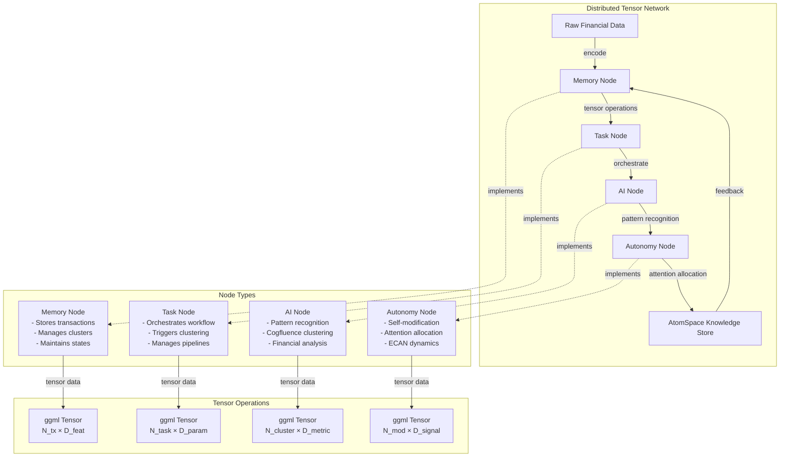
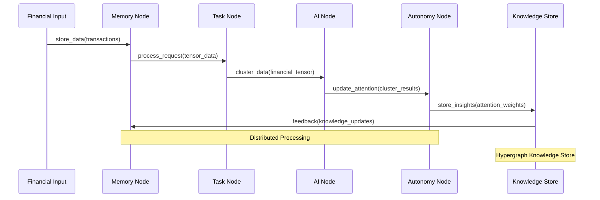
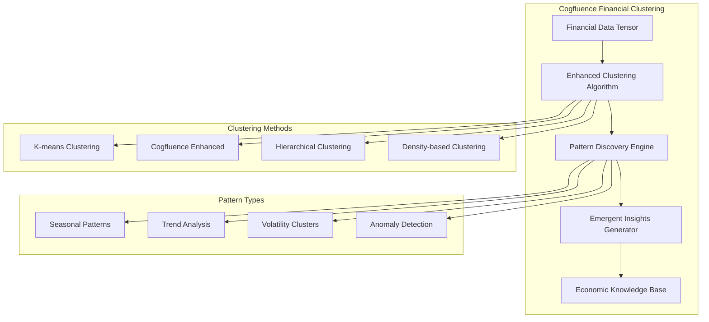
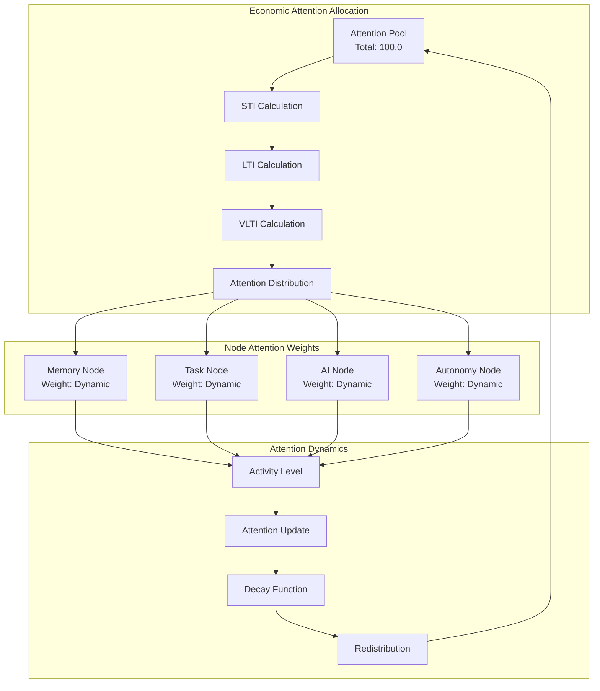
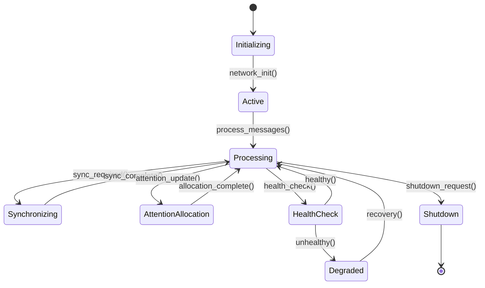
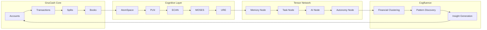
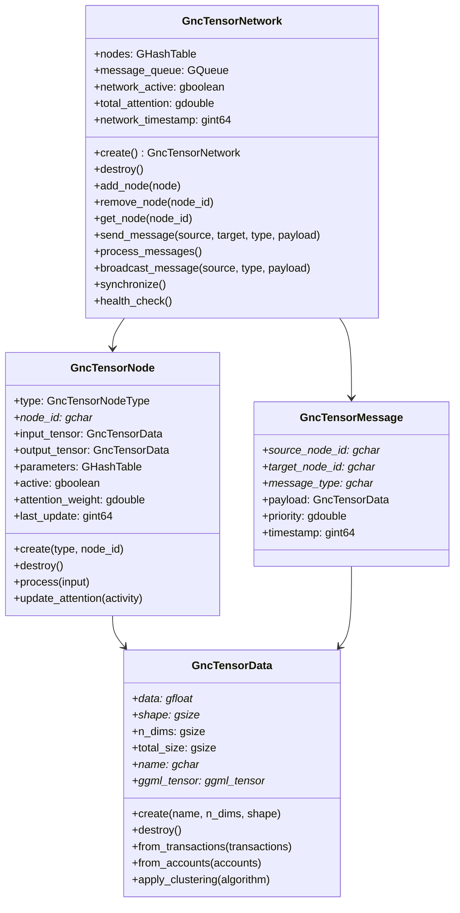

# Distributed Tensor Network Architecture Documentation

## Overview

This document describes the distributed ggml tensor network architecture that transforms GnuCashCog into an agentic cognitive system. The architecture implements a living grammar of cognition where each component serves as a node in the tensor network.

## System Architecture



## Message Passing Architecture



## Tensor Data Flow

```mermaid
flowchart LR
    subgraph "Input Layer"
        A[Transactions] --> B[Account Data]
        B --> C[Financial Metrics]
    end
    
    subgraph "Tensor Encoding"
        D[Transaction Tensor<br/>shape: [N_tx, D_feat]]
        E[Account Tensor<br/>shape: [N_acc, D_acc]]
        F[Metric Tensor<br/>shape: [N_metric, D_val]]
    end
    
    subgraph "Processing Nodes"
        G[Memory Node Processing]
        H[Task Node Processing]
        I[AI Node Processing]
        J[Autonomy Node Processing]
    end
    
    subgraph "Output Layer"
        K[Clustered Data]
        L[Attention Weights]
        M[Insights]
    end
    
    A --> D
    B --> E
    C --> F
    
    D --> G
    E --> H
    F --> I
    
    G --> J
    H --> J
    I --> J
    
    J --> K
    J --> L
    J --> M
```

## Cogfluence Clustering Integration



## ECAN Attention Allocation



## Network Synchronization



## Component Integration



## API Architecture



## Installation and Dependencies

### Required Dependencies

- **ggml**: Tensor operations library
- **OpenCog**: Cognitive architecture framework
- **glib**: Foundation library
- **cmake**: Build system

### Optional Dependencies

- **OpenCog modules**: atomspace, pln, ecan, moses, ure
- **Google Test**: For testing

### Build Configuration

```cmake
# Enable tensor network support
set(HAVE_GGML 1)
set(HAVE_COGFLUENCE_CLUSTERING 1)
add_definitions(-DHAVE_GGML -DHAVE_COGFLUENCE_CLUSTERING)
```

## Usage Examples

### Basic Tensor Network Initialization

```c
// Initialize tensor network
gnc_tensor_network_init();

// Create network context
GncTensorNetwork* network = gnc_tensor_network_create();

// Create nodes
GncTensorNode* memory = gnc_tensor_node_create(GNC_TENSOR_NODE_MEMORY, "memory");
GncTensorNode* ai = gnc_tensor_node_create(GNC_TENSOR_NODE_AI, "ai");

// Add nodes to network
gnc_tensor_network_add_node(network, memory);
gnc_tensor_network_add_node(network, ai);

// Send messages
gnc_tensor_network_send_message(network, "memory", "ai", "process_data", tensor_data);
gnc_tensor_network_process_messages(network);

// Cleanup
gnc_tensor_network_destroy(network);
gnc_tensor_network_shutdown();
```

### Cogfluence Clustering

```c
// Create financial data tensor
GncTensorData* financial_data = gnc_tensor_data_create("financial_data", 2, shape);
GncTensorData* cluster_output = gnc_tensor_data_create("clusters", 2, shape);

// Apply Cogfluence clustering
gnc_cogfluence_cluster_transactions(financial_data, cluster_output, "enhanced");

// Discover patterns
GncTensorData* patterns = gnc_tensor_data_create("patterns", 2, shape);
gnc_cogfluence_discover_patterns(cluster_output, patterns, 0.5);

// Generate insights
GHashTable* insights = g_hash_table_new_full(g_str_hash, g_str_equal, g_free, g_free);
gnc_cogfluence_generate_insights(cluster_output, insights);
```

## Testing

The tensor network includes comprehensive tests covering:

- Network initialization and shutdown
- Node creation and management
- Tensor data encoding and operations
- Message passing and communication
- Attention allocation and ECAN dynamics
- Cogfluence clustering algorithms
- Complete workflow integration

Run tests with:
```bash
make test-tensor-network
```

## Performance Considerations

- **Memory Management**: Efficient tensor allocation and deallocation
- **Message Queue**: Asynchronous processing for scalability
- **Attention Allocation**: Dynamic resource management
- **Clustering**: Optimized algorithms for financial data
- **Network Synchronization**: Minimal overhead coordination

## Future Enhancements

1. **GPU Acceleration**: CUDA/OpenCL support for tensor operations
2. **Distributed Computing**: Multi-node network deployment
3. **Advanced Clustering**: Deep learning integration
4. **Real-time Processing**: Streaming financial data support
5. **Visualization**: Interactive network monitoring tools

## Contributing

Contributions to the tensor network are welcome. Please follow the existing code style and include comprehensive tests for new features.

## License

This tensor network implementation is licensed under the GNU General Public License v2.0, consistent with the GnuCash project.